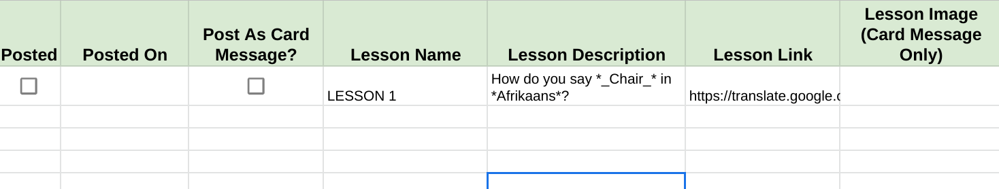
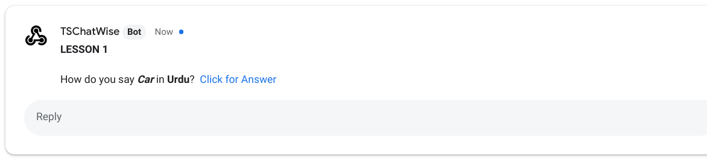
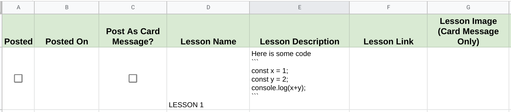

# Getting Started with TSChatWise 


*Image by [Peggy Dyar](https://pixabay.com/users/4Me2Design-3106045/?utm_source=link-attribution&amp;utm_medium=referral&amp;utm_campaign=image&amp;utm_content=2629436) from [Pixabay](https://pixabay.com/?utm_source=link-attribution&amp;utm_medium=referral&amp;utm_campaign=image&amp;utm_content=2629436).*

<br>

---

There are two sheets within the **TSChatWise** template.

1. Lessons
2. Config


We've already seen how to use the **Config** sheet in the [Installation Guide](Install.md).  Now let's learn how to configure the **Lessons** sheet.

<br>

## Step 1: Configure Lessons

**TSChatWise** can post **two types** of lesson messages to Google Chat Rooms:

1. **[Simple Messages](https://developers.google.com/hangouts/chat/reference/message-formats/basic)** - plain text messages with simple formatting options.
2. **[Card Messages](https://developers.google.com/hangouts/chat/reference/message-formats/cards)** - more complex user interface card messages.

> 👉 For more information on message types and formatting see [below](#google-chat-message-types-and-formatting-options).

<br>


<br>


As show above, each row of the **Lesson** sheet represents a lesson to be posted to one or more Google Chat Rooms.  Each row contains **seven data fields** representing each lesson to be posted.  These fields are outlined below.

**1. Posted**

A checkbox ***automatically*** checked by **TSChatWise** when a lesson is posted to any Google Chat Room.

👉 Add a checkbox for each new lesson


👉 Use the spreadsheet **Insert > Checkbox** menu to add a new checkbox.

👉 Make sure the checkbox is __unchecked__ before posting the lesson. 

👉 Uncheck box to schedule/reschedule a lesson post. 

👉 Ensure that there are no extraneous checkboxes in this column or **TSChatWise** will try to post empty lessons.

<br>


**2. Posted On**

Date stamp ***automatically*** added when a lesson is posted to any Google Chat Room.

👉 Do not modify this field.

<br>


**3. Post as Card Message**

Indicates whether the lesson is to be posted as a **[Simple Messages](https://developers.google.com/hangouts/chat/reference/message-formats/basic)** or **[Card Messages](https://developers.google.com/hangouts/chat/reference/message-formats/cards)**.  


👉 Add a checkbox for each new lesson.

👉 Check the box to send as a **card message**.

👉 Use the spreadsheet **Insert > Checkbox** menu to add a new checkbox.

👉 Make sure there is an checkox in this column before posting the lesson.  

<br>


**4. Lesson Name**

Name of lesson to be posted with lesson.  

👉 This is a **required field**.

<br>


**5. Lesson Description**

Lesson content to be posted.  

👉  This is a **required field**.

👉  Can contain additional formatting based upon type of message:  **[Simple Messages](https://developers.google.com/hangouts/chat/reference/message-formats/basic)** or **[Card Messages](https://developers.google.com/hangouts/chat/reference/message-formats/cards)**.  See [advanced formatting section](#google-chat-message-types-and-formatting-options) below for more.

<br>


**6. Lesson Link**

Link to additional lesson content to be included with the posted lesson.  

👉 This is a **optional field**.

👉 Link will be added to the end of the message body for **[Simple Messages](https://developers.google.com/hangouts/chat/reference/message-formats/basic)** messages or as a clickable button link at the end of **[Card Messages](https://developers.google.com/hangouts/chat/reference/message-formats/cards)** messages.

<br>

**7. Lesson Image**

Link to a public accessible image to be included with **[Card Messages](https://developers.google.com/hangouts/chat/reference/message-formats/cards)** messages ONLY. 

👉 This is a **optional field**.

<br>

Posting a **[Simple Message](https://developers.google.com/hangouts/chat/reference/message-formats/basic)** lesson as shown above will produce this output in a Google Chat room.


* 🚧


---

## Step 2: Schedule Lessons

* 🚧

---

## Step 3: Test It Out

* 🚧

---

## Google Chat Message Types and Formatting Options

**TSChatWise** can post **two types** of lesson messages to Google Chat Rooms:

1. **[Simple Messages](https://developers.google.com/hangouts/chat/reference/message-formats/basic)** - plain text messages with simple formatting options.
2. **[Card Messages](https://developers.google.com/hangouts/chat/reference/message-formats/cards)** - more complex user interface card messages.

### Simple Messages

Simple Messages are messages which appear inline as if typed by a user.  Simple messages can contain symbols used to create special formatting as shown in the table below.

| FORMAT | SYMBOL | EXAMPLE | RESULT |
| :----- | :----- | :------ | :----- |
| Bold | * | `*`Bold`*` | **Bold** |
| Italic | `_`(underscore) | `_`Italic`_` | _Italic_ |
| Strikethrough | ~ | `~`Strikethrough`~` | ~Strikethrough~ |
| Monospace | ` | `` ` ``Monospace`` ` ``| `Monospace` |
| Monospace Block | ``` | `` ``` ``Block`` ``` `` | ```Block``` |
| Link | | http://example.com/ | [http://example.com/](http://example.com/) |


For more on simple message alternate links and other formatting options see the [documentation](https://developers.google.com/hangouts/chat/reference/message-formats/basic).

<br>

Following is an example of a simple message from TSChatWise sent to a Google Chat Room.



<br>


<br>

Following is an example of a simple message with an alternate link from TSChatWise sent to a Google Chat Room.


<br>



<br>

Following is an example of a simple message with code from TSChatWise sent to a Google Chat Room.



<br>


---

&nbsp;&nbsp; 👈 [Installation](Install.md) &nbsp;&nbsp; |  &nbsp;&nbsp; [Tips & Tricks](Tips.md) 👉 &nbsp;&nbsp;
