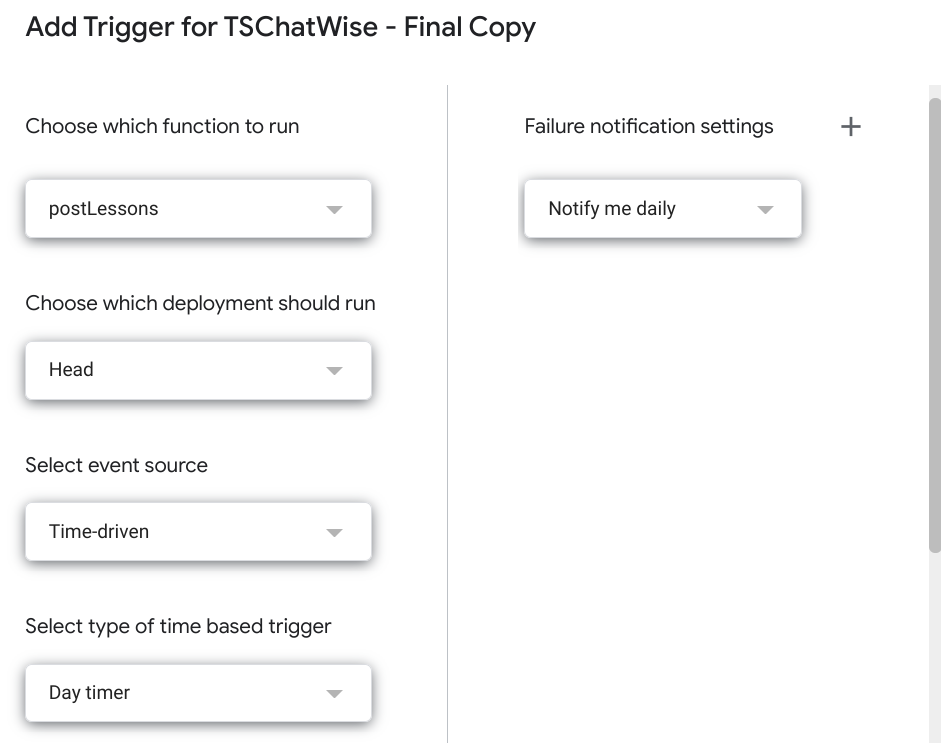

# Getting Started with TSChatWise 

*Image by [Peggy Dyar](https://pixabay.com/users/4Me2Design-3106045/?utm_source=link-attribution&amp;utm_medium=referral&amp;utm_campaign=image&amp;utm_content=2629436) from [Pixabay](https://pixabay.com/?utm_source=link-attribution&amp;utm_medium=referral&amp;utm_campaign=image&amp;utm_content=2629436).*

 

---

There are two sheets within the **TSChatWise** template.

1. Lessons
2. Config

We've already seen how to use the **Config** sheet in the [Installation Guide](Install.md).  Now let's learn how to configure the **Lessons** sheet.

 

## Step 1: Configure Lessons

**TSChatWise** can post **two types** of lesson messages to Google Chat Rooms:

1. **Simple Messages** - plain text messages with simple formatting options.
2. **Card Messages** - more complex user interface card messages.

> 👉 For more information on message types and formatting see [Usage Tips](Usage.md).

 

 

As show above, each row of the **Lesson** sheet represents a lesson to be posted to one or more Google Chat Rooms.  Each row contains **seven data fields** representing each lesson to be posted.  These fields are outlined below.

**1. Posted**

A checkbox ***automatically*** checked by **TSChatWise** when a lesson is posted to any Google Chat Room.

👉 Add a checkbox for each new lesson

👉 Use the spreadsheet **Insert > Checkbox** menu to add a new checkbox.

👉 Make sure the checkbox is __unchecked__ before posting the lesson. 

👉 Uncheck box to schedule/reschedule a lesson post. 

👉 Ensure that there are no extraneous checkboxes in this column or **TSChatWise** will try to post empty lessons.

 

**2. Posted On**

Date stamp ***automatically*** added when a lesson is posted to any Google Chat Room.

👉 Do not modify this field.

 

**3. Post as Card Message**

Indicates whether the lesson is to be posted as a **[Simple Messages](Usage.md#google-chat-message-types-and-formatting-options)** or **[Card Messages](Usage.md#google-chat-message-types-and-formatting-options)**.  

👉 Add a checkbox for each new lesson.

👉 Check the box to send as a **card message**.

👉 Use the spreadsheet **Insert > Checkbox** menu to add a new checkbox.

👉 Make sure there is an checkox in this column before posting the lesson.  

 

**4. Lesson Name**

Name of lesson to be posted with lesson.  

👉 This is a **required field**.

 

**5. Lesson Description**

Lesson content to be posted.  

👉  This is a **required field**.

👉  Can contain additional formatting based upon type of message:  **[Simple Messages](Usage.md#google-chat-message-types-and-formatting-options)** or **[Card Messages](Usage.md#google-chat-message-types-and-formatting-options)**.  See [Usage Tips](Usage.md#google-chat-message-types-and-formatting-options) for more.

 

**6. Lesson Link**

Link to additional lesson content to be included with the posted lesson.  

👉 This is a **optional field**.

👉 Link will be added to the end of the message body for **[Simple Messages](Usage.md#google-chat-message-types-and-formatting-options)** messages or as a clickable button link at the end of **[Card Messages](Usage.md#google-chat-message-types-and-formatting-options)** messages.

 

**7. Lesson Image**

Link to a public accessible image to be included with **[Card Messages](Usage.md#google-chat-message-types-and-formatting-options)** messages ONLY. 

👉 This is a **optional field**.

 

Posting a **[Simple Message](Usage.md#google-chat-message-types-and-formatting-options)** lesson as shown above will produce this output in a Google Chat room.

---

## Step 2: Schedule Lessons

Once the lessons have been configured on the **Lessons** tab, **TSChatWise** can be configured to run by setting up an Apps Script time-based trigger. 

 

To schedule a time-based trigger perform the following steps:

**Open the Google Apps Script Editor**

* Open the **TSChatWise** template *(copied in the [Installation](Installation.md) step)*
* From the Sheet menu select **Tools > Script editor**

**Create a New Apps Script Time Based Trigger**

* In the Apps Script editor, click the **clock** icon on the left side
* In the dashboard, click the **+ Add Trigger** button on the bottom right
* Under **Choose which function to run** be sure to select **postLessons**
* Under **Select event source** select **Time-driven**
* Under **Select type of time based trigger** select the desired interval 
* Set any other desired time based trigger options
* Click the **Save** button to save the configuration

**TSChatWise** is now configured to run on the timed interval.  Once **TSChatWise** has posted all the lessons to the configured Chat Rooms it will automatically unschedule the time-based trigger.  

To reschedule the lessons, uncheck checkboxes in the first column of the **Lessons** sheet and reconfigure a new Apps Script trigger following the steps above.

---

&nbsp;&nbsp; 👈 [Installation](Install.md) &nbsp;&nbsp; |  &nbsp;&nbsp; [Usage Tips](Usage.md) 👉 &nbsp;&nbsp;
