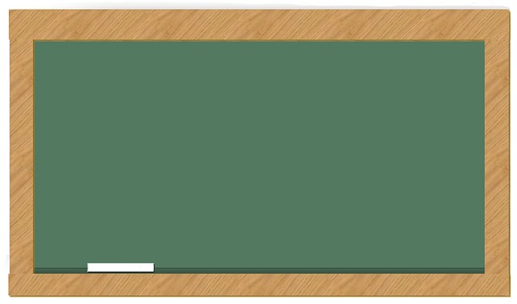

# Getting Started with TSChatWise 



*Image by [Peggy Dyar](https://pixabay.com/users/4Me2Design-3106045/?utm_source=link-attribution&amp;utm_medium=referral&amp;utm_campaign=image&amp;utm_content=2629436) from [Pixabay](https://pixabay.com/?utm_source=link-attribution&amp;utm_medium=referral&amp;utm_campaign=image&amp;utm_content=2629436).*

<br>

---

There are three sheets within the **TSChatWise** template.

1. Lessons
2. Config
3. Examples

We've already seen how to use the **Config** sheet in the [Installation Guide](Install.md).  Now let's turn our attention on how to configure the **Lessons** sheet.

**TSChatWise** can post **two types** of lesson messages to Google Chat Rooms:

1. **Simple Messages** - plain text messages with simple formatting options *For more information see the [documentation](https://developers.google.com/hangouts/chat/reference/message-formats/basic).*
2. **Card Messages** - more complex user interface card messages *For more information see the [documentation](https://developers.google.com/hangouts/chat/reference/message-formats/cards).*


## Step 1: Configure Lessons


To post a lessons to a Google Chat Room:

1. For lessons to be posted as a **Card Message**, check the **Post as Card Message** box.
2. Enter the **Lesson Name** *(this will be posted at the top of the message)*
3. Enter the **Lesson Description** *(this will be posted as the body of the message)*
4. (Optional) Enter a **Lesson Link** _(this will add a link to the message body for **Simple Message** format lessons or a clickable button link for **Card Messages)._
5. (Optional) Enter a link to a public accessible image to be included in **Card Message** posts only.

* 🚧


---

## Step 2: Schedule Lessons

* 🚧

---

## Step 3: Test It Out

* 🚧

---

## Advanced TSChatWise Configuration

<br>

```javascript
// TSChatWise Configuration

const CONFIG_SHEET = 'Config'; // 🧰 Name of TSChatWise 'configuration' sheet

const LESSON_SHEET = 'Lessons'; // ✏️ Name of TSChatWise 'lessons' sheet

const ROOM_URL_COLUMN = 2;  // 🔗 CONFIG_SHEET column which contains the Chat Room URLs 
                            // (column numbering starts at 1)
                            
const EMAIL_COLUMN = 5; // 📥 CONFIG_SHEET column which contains the 'Notify By Email When Complete' checkboxes 
                        // (column numbering starts at 1)

const DATE_FORMAT = "M/d/yyyy k:mm:ss"; // 📆 Timestamp format for posted lessons on LESSON_SHEET 
                                        // See this site for more information 
                                        // https://docs.oracle.com/javase/7/docs/api/java/text/SimpleDateFormat.html


// TSChatWise Chat Message Configuration

const LESSON_BUTTON_TEXT = 'CLICK FOR LESSON'; // 🔳 Lesson chat message button text
```


|  | NAME | TYPE | DESCRIPTION |
| :-------: | :----------------- | :----------------- | :----------------- |
| 🧰 | **`CONFIG_SHEET`** | **General** | Name of **TSChatWise `configuration`** sheet |
| ✏️ | **`LESSON_SHEET`** | **General** | Name of **TSChatWise `lessons`** sheet |
| 🔗 | **`ROOM_URL_COLUMN`** | **General** | **`CONFIG_SHEET` column** which contains the **Chat Room URL(s)** *(column numbering starts at 1)* |
| 📥 | **`EMAIL_COLUMN`** | **General** | **`CONFIG_SHEET` column** which contains the **`'Notify By Email When Complete'` checkboxes** *(column numbering starts at 1)* |
| 📆 | **`DATE_FORMAT`** | **General** | **Timestamp format** *(for posted lessons on `LESSON_SHEET`)*.  See more information on supported [timestamp formats](https://docs.oracle.com/javase/7/docs/api/java/text/SimpleDateFormat.html). |
| 🔳 | **`LESSON_BUTTON_TEXT`** | **Chat Message** | Lesson chat **message button text** |

---

&nbsp;&nbsp; 👈 [Installation](Install.md) &nbsp;&nbsp; |  &nbsp;&nbsp; [Tips & Tricks](Tips.md) 👉 &nbsp;&nbsp;
