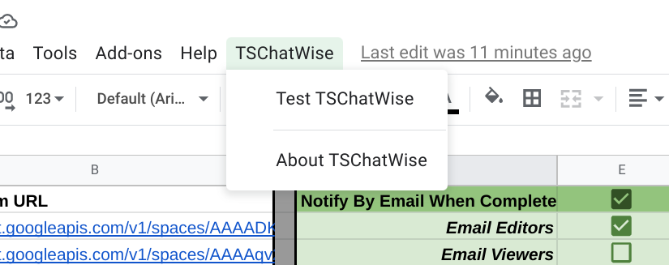

# Install and Configure TSChatWise 

*Image by [Peggy Dyar](https://pixabay.com/users/4Me2Design-3106045/?utm_source=link-attribution&amp;utm_medium=referral&amp;utm_campaign=image&amp;utm_content=2629436) from [Pixabay](https://pixabay.com/?utm_source=link-attribution&amp;utm_medium=referral&amp;utm_campaign=image&amp;utm_content=2629436).*

 

---

## Step 1: Install TSChatWise

To install **TSChatWise**:

> * *Login to [Google Drive](https://drive.google.com/).*
> * *Access the __TSChatWise__ Google Sheets template.*
> * *Click the __Use Template__ button. This will copy the sheet template to Google Drive.*

---

 

## Step 2: Create Chat Room(s)

Follow the steps outlined in the [Google Chat Room - Create a room](https://support.google.com/chat/answer/7653861?hl=en&ref_topic=7649113) documentation to setup a Google Chat room. 

👉 *TSChatWise can post the same lesson to __multiple__ Google Chat rooms.*

👉 *[Google Chat must be enabled](https://support.google.com/a/answer/7651884?hl=en) in your domain to setup Google Chat.  Check with your G Suite Administrator if Google Chat is disabled.*

 

## Step 3: Create Chat Room Webhook

**Access the Chat Room Webhooks**

* Go to [Google Chat](https://chat.google.com)
* Select the desired **Chat room** *(or create a new one)* from the left side of the screen
* Select the **dropdown** for the room name at the top of the screen
* Select **Manage webhooks**

 

**Enter a Webhook Name**

* Enter a webhook name **TSChatWise**
* *(Optional) Enter an Avatar URL*
* Click **Save**

*:point_right: Multiple chat bots can provide notifications to a single [Google Chat Room](https://gsuite.google.com/products/chat/).  Be sure to use descriptive webhook names to disguish multiple bots.*

 

**Make a Copy of the URL**

* Click the **Copy** button to make a copy of the webhook URL

 

## Step 4: Configure TSChatWise

**Open TSChatWise template**

* Open the __TSChatWise Google Sheet__ copied to your Google Drive during **Step 1** installation.
* Navigate to the __Config__ sheet.
 
**Add Chat Room URL to TSChatWise 'Config' Sheet**

* Under **Chat Room Name** enter the name of the Chat room from **Step 3** above
* Under **Chat Room URL** enter the URL copied in **Step 3** above

**Configure Notifications When Lessons Complete**

To be notified when all lessons have been posted to all chat rooms:

* Check the box to the right of **Notify By Email When Complete**
  * Check the box to the right of **Email Editors** for all TSChatWise Google Sheet editors & owner to be notified
  * Check the box to the right of **Email Viewers** for all TSChatWise Google Sheet viewers to be notified

 

## Step 6: Test TSChatWise

*  Select **TSChatWise > Test TSChatWise** option from the Google Sheet menu.  *This will send a test message to each configured chat room.*

*:point_right: The __first time__ TSChatWise is run it will __require authorization__.  Follow the Google prompts to authorize TSChatWise.*

 

## Important Notes

* Multiple versions of **TSChatWise** can be used to provide notifications to a single [Google Chat Room](https://gsuite.google.com/products/chat/).

* A single version of **TSChatWise** can provide notifications to multiple [Google Chat Rooms](https://gsuite.google.com/products/chat/).

* Check the [Apps Script Dashboard](https://script.google.com) for execution errors if TSFormBot does not work as expected.

---

&nbsp;&nbsp; 👈 [About](About.md) &nbsp;&nbsp; |  &nbsp;&nbsp; [Getting Started](GettingStarted.md) 👉 &nbsp;&nbsp;
