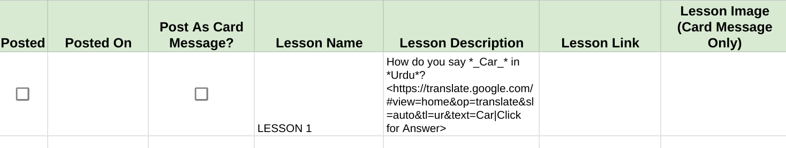
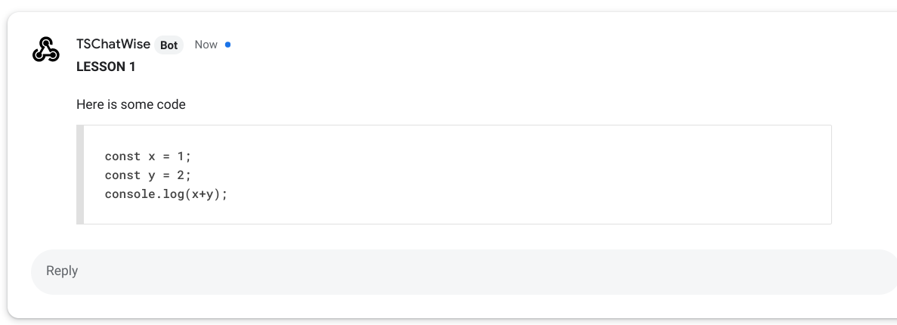

# TSChatWise Tips & Tricks

*Image by [Peggy Dyar](https://pixabay.com/users/4Me2Design-3106045/?utm_source=link-attribution&amp;utm_medium=referral&amp;utm_campaign=image&amp;utm_content=2629436) from [Pixabay](https://pixabay.com/?utm_source=link-attribution&amp;utm_medium=referral&amp;utm_campaign=image&amp;utm_content=2629436).*

 

---

## Google Chat Message Types and Formatting Options

**TSChatWise** can post **two types** of lesson messages to Google Chat Rooms:

1. **[Simple Messages](https://developers.google.com/hangouts/chat/reference/message-formats/basic)** - plain text messages with simple formatting options.
2. **[Card Messages](https://developers.google.com/hangouts/chat/reference/message-formats/cards)** - more complex user interface card messages.

### Simple Messages

Simple Messages are messages which appear inline as if typed by a user.  Simple messages can contain symbols used to create special formatting.  For more on simple message formatting options see the [documentation](https://developers.google.com/hangouts/chat/reference/message-formats/basic).

 

Following is an example of a ***simple message*** sent to a Google Chat Room.

 

 

Following is an example of a ***simple message with an alternate link*** sent to a Google Chat Room.

 

 

Following is an example of a ***simple message with code*** sent to a Google Chat Room.

 

 

### Card Messages

Card Messages are Google Chat message which contain a more complex user interface in the form of cards.  Card messages can contain special formatting.  For more on card message formatting options see the [documentation](https://developers.google.com/hangouts/chat/reference/message-formats/cards#card_formatting).

...

---

&nbsp;&nbsp; 👈 [Getting Started](GettingStarted.md) &nbsp;&nbsp; 
